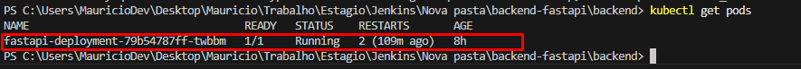

# Documentação do Projeto - Backend FastAPI com Jenkins e Kubernetes

## 1. Objetivo do Projeto
Criar uma aplicação backend usando FastAPI, com pipeline automatizado no Jenkins para build e deploy do container Docker, além de deploy no Kubernetes para orquestração.

---

## 2. Estrutura do Projeto
- **backend-fastapi**: código da aplicação FastAPI.
- **k8s/**: arquivos de configuração para Kubernetes (deployments, services).
- **Jenkinsfile**: pipeline declarativo para automatizar build, teste, push da imagem Docker.

projeto-kubernetes-pb-desafio-jenkins/
│
├── backend/
│   ├── src/
│       ├──App.js
│       ├──Index.js
│       ├──api.js
├── frontend/
│   ├── main.py
│   ├── Dockerfile
│   ├── requirements.txt
├── k8s/
│   ├── deployment.yaml
│   ├── service.yaml
│
├── Jenkinsfile
├── README.md


---

## 3. Aplicação FastAPI
- Criada em Python 3.11.
- Endpoints simples (exemplo `/color` que retorna JSON com cor).
- Rodando localmente na porta `8000`.
- Dockerizada com Dockerfile para facilitar o deploy em containers.

### Comandos para rodar localmente:
```bash
# Rodar a aplicação local (exemplo com uvicorn)
uvicorn main:app --host localhost --port 8000


## 4. Docker

- Build da imagem local com nome `mauriciobertoldo/backend-fastapi:latest`.
- Push da imagem para o Docker Hub usando credenciais configuradas no Jenkins.
- Porta do container exposta: **8000**.

### Comandos Docker usados:

```bash
# Build da imagem Docker
docker build -t mauriciobertoldo/backend-fastapi:latest .

# Login no Docker Hub
docker login

# Push da imagem para o Docker Hub
docker push mauriciobertoldo/backend-fastapi:latest


## 5. Jenkins

Jenkins instalado localmente.

Pipeline configurado via `Jenkinsfile` com as seguintes etapas:

- **Checkout** do código do Git.
- **Debug** do workspace (listar arquivos).
- **Instalação de dependências** Python via container.
- **Testes** (etapa pulada por enquanto).
- **Build** da imagem Docker.
- **Push** da imagem Docker para o Docker Hub.

### Exemplo do Jenkinsfile:

```groovy
pipeline {
    agent any

    environment {
        DOCKER_HUB_CREDENTIALS = 'docker-hub-credentials-id'
        IMAGE_NAME = 'mauriciobertoldo/backend-fastapi'
    }

    stages {
        stage('Checkout') {
            steps {
                checkout scm
            }
        }

        stage('Debug workspace') {
            steps {
                bat 'dir'
            }
        }

        stage('Install dependencies') {
            steps {
                script {
                    def path = env.WORKSPACE.replace('\\', '/')
                    bat """
                    docker run --rm -v ${path}:/app -w /app python:3.11-slim pip install -r requirements.txt
                    """
                }
            }
        }

        stage('Run tests') {
            steps {
                echo 'Sem testes configurados, pulando etapa'
            }
        }

        stage('Build Docker image') {
            steps {
                script {
                    dockerImage = docker.build("${IMAGE_NAME}:latest")
                }
            }
        }

        stage('Push Docker image') {
            steps {
                script {
                    docker.withRegistry('', DOCKER_HUB_CREDENTIALS) {
                        dockerImage.push()
                    }
                }
            }
        }
    }
}

## 6. Kubernetes

- Serviço criado do tipo **NodePort** para expor o app externamente.
- Porta do serviço: `8000`, mapeada para a porta `30001` no nó.
- Deployment criado com pods rodando a imagem do Docker Hub.
- Verificação dos pods e serviços realizada com `kubectl`.

### Comandos Kubernetes usados:

```bash
# Aplicar deployment e service
kubectl apply -f k8s/deployment.yaml
kubectl apply -f k8s/service.yaml

# Verificar pods
kubectl get pods

# Verificar serviços
kubectl get svc

# Testar o serviço localmente
curl http://localhost:30001/color

## 7. Exposição externa para Webhook (túnel)

- Utilizado [serveo.net](https://serveo.net) para expor a porta `8000` localmente para a internet.
- Gera uma URL pública que pode ser usada para configurar **Webhooks**, como no GitHub.

### Comando usado:

```bash
ssh -R 0:localhost:8000 serveo.net

Esse comando retorna uma URL pública, como:
```bash
https://seu-projeto.serveo.net

## 8. Integração com Webhook do GitHub (CI/CD)

- Através da URL pública fornecida pelo túnel (`serveo.net`), foi configurado um **Webhook** no GitHub para notificar o Jenkins a cada push no repositório.

### Etapas seguidas:

1. Criar um Job no Jenkins com o nome `deploy-fastapi`.
2. No GitHub, acessar:
   `Settings` → `Webhooks` → `Add webhook`
3. Preencher os seguintes dados:
   - **Payload URL**: `http://seu-projeto.serveo.net/job/deploy-fastapi/build?token=seu-token`
   - **Content type**: `application/x-www-form-urlencoded`
   - **Secret**: (opcional)
   - Selecionar: `Just the push event`
   - Ativar a opção `Active`

4. No Jenkins, ativar o gatilho:
   - Marcar a opção:  
     `GitHub hook trigger for GITScm polling`

5. Ao realizar um `git push`, o GitHub envia uma requisição para a URL pública e o Jenkins inicia automaticamente a pipeline.


## 9. Como rodar o projeto localmente 🚀

### ✅ Pré-requisitos:
- Docker
- Node.js e npm
- Python 3.11+
- Kubectl
- Jenkins (opcional)
- Conta no Docker Hub

---

### 📦 1. Clonar o repositório

```bash
git clone https://github.com/seu-usuario/seu-repositorio.git
cd projeto-kubernetes-pb-desafio-jenkins

### 🐍 2. Rodar o Backend localmente (FastAPI)

```bash
cd backend
pip install -r requirements.txt
uvicorn main:app --host 0.0.0.0 --port 8000

### ⚛️ 3. Rodar o Frontend localmente (React)

```bash
cd ../frontend
npm install
npm start
Acesse: http://localhost:3000

### 🐳 4. Build e push da imagem Docker

```bash
cd backend
docker build -t mauriciobertoldo/backend-fastapi:latest .
docker login
docker push mauriciobertoldo/backend-fastapi:latest

### ☸️ 5. Aplicar o deploy no Kubernetes

```bash
kubectl apply -f k8s/deployment.yaml
kubectl apply -f k8s/service.yaml

kubectl get pods
kubectl get svc

Acesse o serviço via NodePort em:
```bash
http://localhost:30001/color

### 🌐 6. Expor para internet com Serveo (opcional, para Webhook)

```bash
ssh -R 8000:localhost:8000 serveo.net